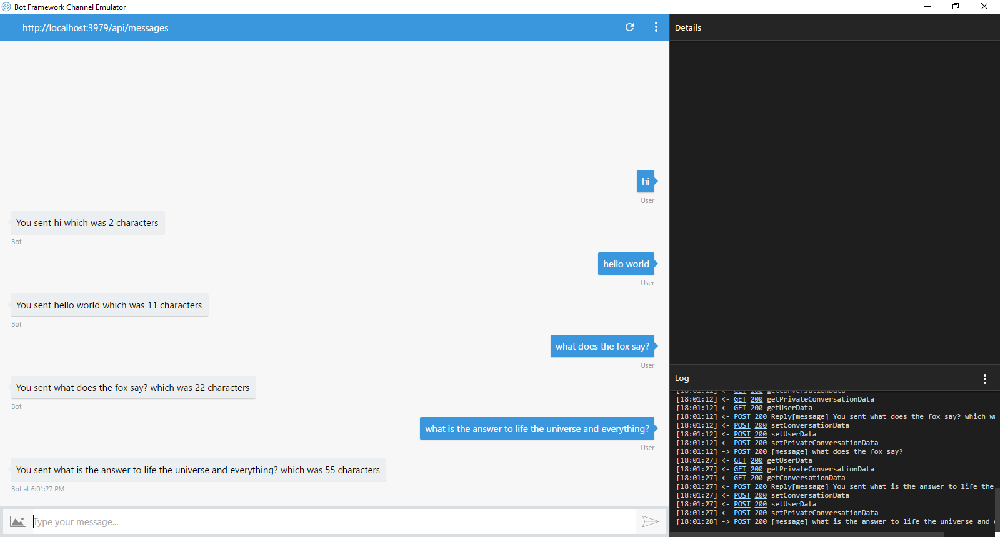

## Building a Bot ##

### Setting up for Bot Development ###

We will be developing a bot using the C# SDK.  To get started, you need two things:
1. The Bot Framework project template, which you can download from http://aka.ms/bf-bc-vstemplate.  The file is called "Bot Application.zip" and you should save it into the &lt;Documents&gt;\Visual Studio 2015\Templates\ProjectTemplates\Visual C#\ directory (_note: if you're on VS2017, adjust the path accordingly_).  Just drop the whole zipped file in there; no need to unzip.  
2. Download the Bot Framework Emulator for testing your bot locally from https://emulator.botframework.com/.  The emulator installs to `c:\Users\`_your-username_`\AppData\Local\botframework\app-3.5.27\botframework-emulator.exe`.  

### Create a Simple Bot ###

In Visual Studio, open your solution -->  go to File --> New Project and create a Bot Application.  You can name it "PictureBot" or something similar.  

Browse around and examine the sample bot code, which is an echo bot that repeats back your message and its length in characters.  In particular, note:
+ In **WebApiConfig.cs** under App_Start, the route template is api/{controller}/{id} where the id is optional.  That is why we always call the bot's endpoint with api/messages appended at the end.  
+ The **MessagesController.cs** under Controllers is therefore the entry point into your bot.  Notice that a bot can respond to many different activity types, and sending a message will invoke the RootDialog.  
+ In **RootDialog.cs** under Dialogs, "StartAsync" is the entry point which waits for a message from the user, and "MessageReceivedAsync" is the method that will handle the message once received and then wait for further messages.  We can use "context.PostAsync" to send a message from the bot back to the user.  

### Run the Bot ###

Click F5 to run the sample code.  NuGet should take care of downloading the appropriate dependencies.  

The code will launch in your default web browser in a URL similar to http://localhost:3979/.  

Launch the Bot Framework Emulator and connect to the bot. Now you should be able to converse with the bot.  

 

### Add Intelligence to your Bot with LUIS ###

Now let's expand this bot to integrate with our picture scenario.  We can give it some natural language capabilities with the [Language Understanding Intelligent Service](https://www.luis.ai/), or LUIS.  LUIS allows you to map natural language utterances to intents.  For our application, we might have several intents: finding pictures, sharing pictures, and ordering prints of pictures, for example.  We can give a few example utterances as ways to ask for each of these things, and LUIS will map additional new utterances to each intent based on what it has learned.  

Navigate to https://www.luis.ai and sign in using your Microsoft account.  (This should be the same account that you used to create the Cognitive Services keys at the beginning of this lab.)  You should be redirected to a list of your LUIS applications at https://www.luis.ai/applications.  We will create a new LUIS app to support our bot.  

> Fun Aside: Notice that there is also an "Import App" next to the "New App" button on [the current page](https://www.luis.ai/applications).  After creating your LUIS application, you have the ability to export the entire app as JSON, and check it into source control.  This is a recommended best practice so you can version your LUIS models as you version your code.  An exported LUIS app may be re-imported using that "Import App" button.  If you fall behind during the lab and want to cheat, you can click the "Import App" button and import the [LUIS model from the Finished section](./Finished/LUIS/PictureBotLuisModel.json).  

From https://www.luis.ai/applications, click the "New App" button.  Give it a name (I chose "PictureBotLuisModel") and set the Culture to "English".  You can optionally provide a description.  Click the dropdown to select an endpoint key to use, and if the LUIS key that you created on the Azure portal at the beginning of this lab is there, select it.  Then click "Create".  

 

You will be taken to a Dashboard for your new app.  The App Id is displayed; note that down for later as your **LUIS App ID**.  Then click "Create an intent".  

 

We want our bot to be able to do the following things:
+ Search/find pictures
+ Greet the user

Let's create intents for the user requesting each of these.  Click the "Add intent" button.  

Name the first intent "Greeting" and click "Save".  Then give several examples of things the user might say when greeting the bot, pressing "Enter" after each one.  After you have entered some utterances, click "Save".  

 

Now let's see how to create an entity.  When the user requests to search the pictures, they may specify what they are looking for.  Let's capture that in an entity.  

Click on "Entities" in the left-hand column and then click "Add custom entity".  Give it an entity name "facet" and entity type "Simple".  Then click "Save".  

 

Now click "Intents" in the left-hand sidebar and then click the yellow "Add Intent" button.  Give it an intent name of "SearchPics" and then click "Save".  

Now let's add some sample utterances (words/phrases/sentences the user might say when talking to the bot).  People might search for pictures in many ways.  Feel free to use some of the utterances below, and add your own wording for how you would ask a bot to search for pictures.  

+ Find outdoor pics
+ Are there pictures of a train?
+ Find pictures of food.
+ Search for photos of a 6-month-old boy
+ Please give me pics of 20-year-old women
+ Show me beach pics
+ I want to find dog photos
+ Search for pictures of women indoors
+ Show me pictures of girls looking happy
+ I want to see pics of sad girls
+ Show me happy baby pics

Now we have to teach LUIS how to pick out the search topic as the "facet" entity.  Hover and click over the word (or drag to select a group of words) and then select the "facet" entity.  

 

Note too that there is one intent called "None".  Random utterances that don't map to any of your intents may be mapped to "None".  You are welcome to seed it with a few, like "Do you like peanut butter and jelly?"

Now we are ready to train our model.  Click "Train & Test" in the left sidebar.  Then click the train button.  This builds a model to do utterance --> intent mapping with the training data you've provided.  

Then click on "Publish App" in the left sidebar.  If you have not already done so, select the endpoint key that you set up earlier, or follow the link to create a new key in your Azure account.  You can leave the endpoint slot as "Production".  Then click "Publish".  

 

Publishing creates an endpoint to call the LUIS model.  The URL will be displayed.  

Click on "Train & Test" in the left sidebar.  Check the "Enable published model" box to have the calls go through the published endpoint rather than call the model directly.  Try typing a few utterances and see the intents returned.  

 


### Update Bot to use LUIS ###

Now we want to update our bot to use LUIS.  We can do this by using the [LuisDialog class](https://docs.botframework.com/en-us/csharp/builder/sdkreference/d8/df9/class_microsoft_1_1_bot_1_1_builder_1_1_dialogs_1_1_luis_dialog.html).  

In the **RootDialog.cs** file, add references to the following namespaces:

```csharp

using Microsoft.Bot.Builder.Luis;
using Microsoft.Bot.Builder.Luis.Models;

```

Then, change the RootDialog class to derive from LuisDialog<object> instead of IDialog<object>.  Then, give the class a LuisModel attribute with the LUIS App ID and LUIS key.  (HINT: The LUIS App ID will have hyphens in it, and the LUIS key will not.  If you can't find these values, go back to http://luis.ai.  Click on your application, and the App ID is displayed right on the Dashboard page, as well as in the URL.  Then click on ["My keys" in the top sidebar](https://www.luis.ai/home/keys) to find your Endpoint Key in the list.)  

```csharp

using System;
using System.Threading.Tasks;
using Microsoft.Bot.Builder.Dialogs;
using Microsoft.Bot.Connector;
using Microsoft.Bot.Builder.Luis;
using Microsoft.Bot.Builder.Luis.Models;

namespace TestPictureBot.Dialogs
{
    [LuisModel("96f65e22-7dcc-4f4d-a83a-d2aca5c72b24", "1234bb84eva3481a80c8a2a0fa2122f0")]
    [Serializable]
    public class RootDialog : LuisDialog<object>
    {

```

> Fun Aside: You can use [Autofac](https://autofac.org/) to dynamically load the LuisModel attribute on your class instead of hardcoding it, so it could be stored properly in a configuration file.  There is an example of this in the [AlarmBot sample](https://github.com/Microsoft/BotBuilder/blob/master/CSharp/Samples/AlarmBot/Models/AlarmModule.cs#L24).  

Next, delete the two existing methods in the class (StartAsync and MessageReceivedAsync).  LuisDialog already has an implementation of StartAsync that will call the LUIS service and route to the appropriate method based on the response.  

Finally, add a method for each intent.  The corresponding method will be invoked for the highest-scoring intent.  We will start by just displaying simple messages for each intent.  

```csharp

        [LuisIntent("")]
        [LuisIntent("None")]
        public async Task None(IDialogContext context, LuisResult result)
        {
            await context.PostAsync("Hmmmm, I didn't understand that.  I'm still learning!");
        }

        [LuisIntent("Greeting")]
        public async Task Greeting(IDialogContext context, LuisResult result)
        {
            await context.PostAsync("Hello!  I am a Photo Organization Bot.  I can search your photos, share your photos on Twitter, and order prints of your photos.  You can ask me things like 'find pictures of food'.");
        }

        [LuisIntent("SearchPics")]
        public async Task SearchPics(IDialogContext context, LuisResult result)
        {
            await context.PostAsync("Searching for your pictures...");
        }

```

Now, let's run our code.  Hit F5 to run in Visual Studio, and start up a new conversation in the Bot Framework Emulator.  Try chatting with the bot, and ensure that you get the expected responses.  If you get any unexpected results, note them down and we will revise LUIS.  

 


### Configure for Azure Search ###

First, we need to provide our bot with the relevant information to connect to an Azure Search index. 

Open Web.config and in the appSettings section, add the following:

```xml    
    <!-- Azure Search Settings -->
    <add key="searchServiceName" value="" />
    <add key="searchServiceApiKey" value="" />
    <add key="indexName" value="" />
    <add key="imageBaseUrl" value="" />
```

### Update Bot to use Azure Search ###

Now, let's update the bot to call Azure Search.  

Add the Azure.Search nuget package 

models/ImageInsight.cs.  Add this code:

```csharp
using System.ComponentModel.DataAnnotations;
using Microsoft.Azure.Search;
using Microsoft.Azure.Search.Models;

namespace AzureChallengeNetwerk.Bot.Models
{
    [SerializePropertyNamesAsCamelCase]
    public class ImageInsight
    {
        [Key, IsFilterable, IsSearchable]
        public string ImageId { get; set; }

        [IsSearchable, IsFilterable]
        public string Caption { get; set; }

        [IsSearchable, IsFilterable, IsFacetable]
        public string[] Tags { get; set; }
    }
}

```

"Dialogs/SearchDialog.cs".  Add this code:

```csharp
using System;
using System.Configuration;
using System.Linq;
using System.Threading.Tasks;
using AzureChallengeNetwerk.Bot.Models;
using Microsoft.Azure.Search;
using Microsoft.Azure.Search.Models;
using Microsoft.Bot.Builder.Dialogs;
using Microsoft.Bot.Connector;

namespace AzureChallengeNetwerk.Bot.Dialogs
{
    [Serializable]
    public class SearchDialog : IDialog<object>
    {
        private readonly string _searchText;
        private readonly string _searchServiceName;
        private readonly string _searchServiceApiKey;
        private readonly string _indexName;
        private readonly string _imageBaseUrl;

        public SearchDialog(string facet)
        {
             _searchText = facet;
             _searchServiceName = ConfigurationManager.AppSettings["searchServiceName"];
             _searchServiceApiKey = ConfigurationManager.AppSettings["searchServiceApiKey"];
             _indexName = ConfigurationManager.AppSettings["indexName"];
             _imageBaseUrl = ConfigurationManager.AppSettings["imageBaseUrl"];
        }

        public async Task StartAsync(IDialogContext context)
        {
            // Connect to Azure search
            SearchServiceClient searchClient = new SearchServiceClient(_searchServiceName, new SearchCredentials(_searchServiceApiKey));
            ISearchIndexClient indexClient = searchClient.Indexes.GetClient(_indexName);
            DocumentSearchResult<ImageInsight> results = indexClient.Documents.Search<ImageInsight>(_searchText);

            await SendResults(context, results);
        }

        private async Task SendResults(IDialogContext context, DocumentSearchResult<ImageInsight> results)
        {
            // Creating the response message
            var message = context.MakeMessage();

            if (results.Results.Count == 0)
            {
                await context.PostAsync("There were no results found for \"" + _searchText + "\".");
                context.Done<object>(null);
            }
            else
            {
                var cards = results.Results.Select(h => new HeroCard
                {
                    Title = h.Document.ImageId,
                    Images = new[] { new CardImage(_imageBaseUrl, h.Document.ImageId) },
                    Text = h.Document.Caption
                });
                message.AttachmentLayout = AttachmentLayoutTypes.Carousel;
                message.Attachments = cards.Select(c => c.ToAttachment()).ToList();
                message.Text = "Here are the results that I found:";

                await context.PostAsync(message);
                context.Done<object>(null);
            }
        }
    }
}

```

Finally, we need to update your RootDialog to call the SearchDialog.  In RootDialog.cs in the Dialogs folder, update the SearchPics method and add these "ResumeAfter" methods:

```csharp

        [LuisIntent("SearchPics")]
        public async Task SearchPics(IDialogContext context, LuisResult result)
        {
            // Check if LUIS has identified the search term that we should look for.  
            string facet = null;
            EntityRecommendation rec;
            if (result.TryFindEntity("facet", out rec)) facet = rec.Entity;

            // If we don't know what to search for (for example, the user said
            // "find pictures" or "search" instead of "find pictures of x"),
            // then prompt for a search term.  
            if (string.IsNullOrEmpty(facet))
            {
                PromptDialog.Text(context, ResumeAfterSearchTopicClarification,
                    "What kind of picture do you want to search for?");
            }
            else
            {
                await context.PostAsync("Searching pictures...");
                context.Call(new SearchDialog(facet), ResumeAfterSearchDialog);
            }
        }

        private async Task ResumeAfterSearchTopicClarification(IDialogContext context, IAwaitable<string> result)
        {
            string searchTerm = await result;
            context.Call(new SearchDialog(searchTerm), ResumeAfterSearchDialog);
        }

        private async Task ResumeAfterSearchDialog(IDialogContext context, IAwaitable<object> result)
        {
            await context.PostAsync("Done searching pictures");
        }

```

Press F5 to run your bot again.  In the Bot Emulator, try searching with "find dog pics" or "search for happiness photos".  Ensure that you are seeing results when tags from your pictures are requested.  


### Deploy your bot ###

Adjust your build / deployment plan to deploy a bot to a new WebApp that shares the App Service Plan.

### Register with the Bot Connector ###

Now, go to a web browser and navigate to http://dev.botframework.com.  Click [Register a bot](https://dev.botframework.com/bots/new).  Fill out your bot's name, handle, and description.  Your messaging endpoint will be your Azure website URL with "api/messages" appended to the end, like https://testpicturebot.azurewebsites.net/api/messages.  

 

Then click the button to create a Microsoft App ID and password.  This is your Bot App ID and password that you will need in your Web.config.  Store your Bot app name, app ID, and app password in a safe place!  Once you click "OK" on the password, there is no way to get back to it.  Then click "Finish and go back to Bot Framework".  

 

On the bot registration page, your app ID should have been automatically filled in.  You can optionally add an AppInsights instrumentation key for logging from your bot.  Check the box if you agree with the terms of service and click "Register".  

You are then taken to your bot's dashboard page, with a URL like https://dev.botframework.com/bots?id=TestPictureBot but with your own bot name. This is where we can enable various channels.  Two channels, Skype and Web Chat, are enabled automatically.  

Finally, you need to update your bot with its registration information.  Return to Visual Studio and open Web.config.  Update the BotId with the App Name, the MicrosoftAppId with the App ID, and the MicrosoftAppPassword with the App Password that you got from the bot registration site.  

```xml

    <add key="BotId" value="TestPictureBot" />
    <add key="MicrosoftAppId" value="95b76ae6-8643-4d94-b8a1-916d9f753ab0" />
    <add key="MicrosoftAppPassword" value="kC200000000000000000000" />

```

Rebuild your project, and then right-click on the project in the Solution Explorer and select "Publish" again.  Your settings should be remembered from last time, so you can just hit "Publish".  

Now you can navigate back to your bot's dashboard (something like https://dev.botframework.com/bots?id=TestPictureBot).  Try talking to it in the Chat window.  The carousel may look different in Web Chat than the emulator.  There is a great tool called the Channel Inspector to see the user experience of various controls in the different channels at https://docs.botframework.com/en-us/channel-inspector/channels/Skype/#navtitle.  
From your bot's dashboard, you can add other channels, and try out your bot in Skype, Facebook Messenger, or Slack.  Simply click the "Add" button to the right of the channel name on your bot's dashboard, and follow the instructions.

### Extra Credit 2 ###
